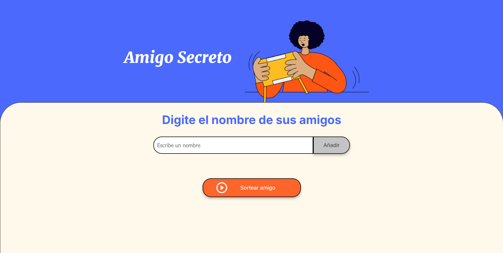
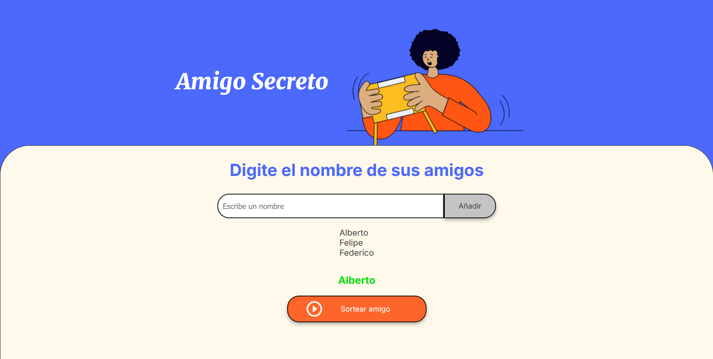

## :tada: AMIGO SECRETO

Amigo Secreto es una aplicación web interactiva que facilita la organización de un sorteo de amigo secreto entre un grupo de participantes. Desarrollada con HTML, CSS y JavaScript, permite agregar nombres de participantes, visualizar la lista y realizar el sorteo de manera aleatoria.

## :hammer: Funcionalidades del proyecto

- `Agregar partisipantes`: Insertar nombres en un campo de texto que posteriormente iran a una lista
- `Validacion de entrada`: Verifica que los nombres proporcionados en el campo de texto sean correctos
- `Sorteo aleatorio`: Sortear los amigos dentro de la lista, seleccionando 1 aleatorio

## :ballot_box_with_check: Tecnologías utilizadas 

- `HTML 5`
- `CSS3`
- `Javascript`

## :clipboard: Instrucciones de uso

1. Agregar participantes:
- escribe el nombre de un participante en el campo de texto
- Haz clic en el botón "Añadir" para agregar el nombre a la lista
2. Realizar el Sorteo:
- Una vez que hayas añadido todos los nombres, haz clic en el botón "Sortear amigo".
- La aplicación asignará aleatoriamente un amigo secreto a cada participante y mostrará los resultados en pantalla.
3. Reiniciar:
- Si deseas realizar un nuevo sorteo, puedes recargar la página para comenzar de nuevo.

## :file_folder: Estructura del Proyecto
- `index.HTML`: Estructura principal de la aplicación.
- `style.css`: Estilos de la interfaz.
- `app.js`: Lógica de la aplicación en JavaScript.

## :camera: Capturas de pantalla

